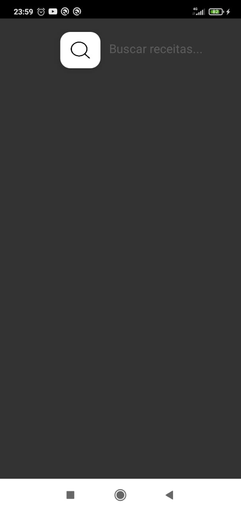
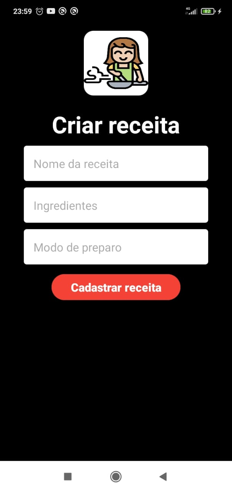
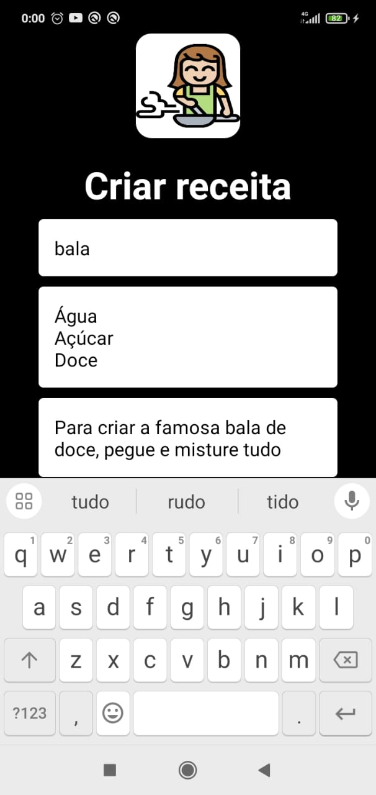
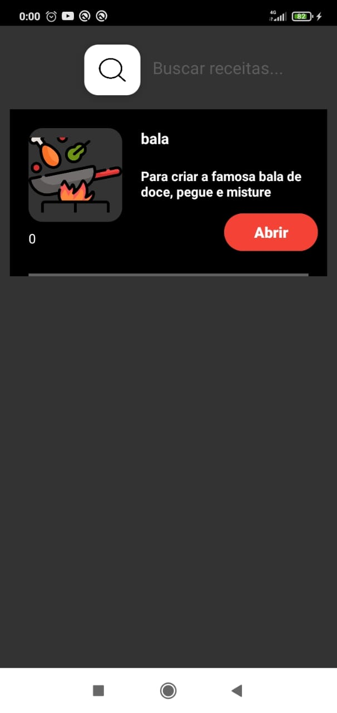
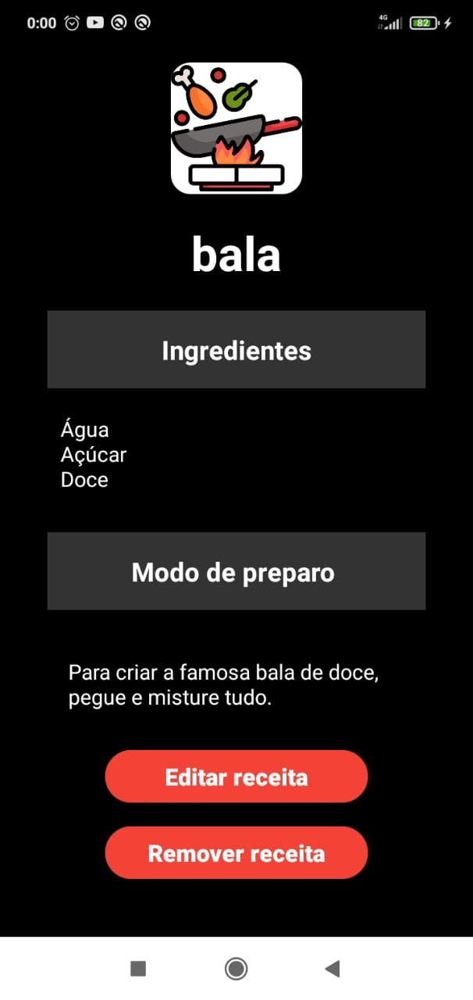

# Diario de Receitas

App desenvolvido para disciplina de Programação Avançada utilizando kotlin para desenvolvimento mobile.

## Ideia

A ideia estrutural veio de um [tutorial do Stack Mobile](https://www.youtube.com/watch?v=yC13iAYPsoo), criando um app de restaurante com kotlin.
A partir desse vídeo tutorial foi implementado um montão de funcionalidades e telas que satisfazesse o app exigido na disciplina.

## Imgs

Pagina inicial

Pagina para ver receitas criadas

Pagina para criar receitas

Pagina criando receita

Pagina para ver receitas criadas

Pagina para ver receitas completa

